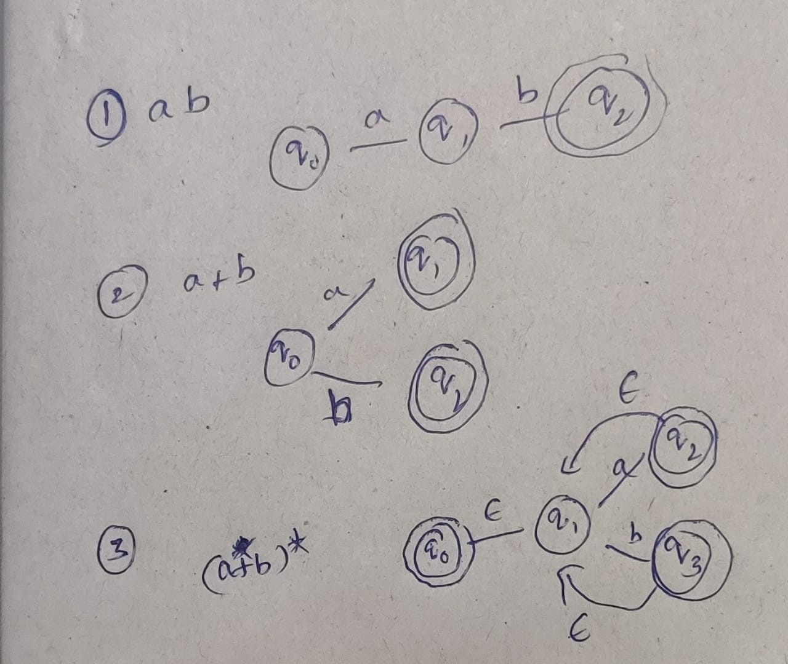

# Programming Assignment

Assignment consists of 4 questions:
1. Conversion of Regex to NFA
2. Conversion of NFA to DFA
3. Conversion of DFA to regex
4. Minimization of DFA

***

Run the python scripts using the following command

```bash

python3 q{question_number}.py input.json output.json

```
## Question 1:
### Conversion of Regex to NFA


Here input.json consists of the JSON version of regex and output.json will be created on execution of q1.py python script and consists of equivalent NFA.


Steps involved in conversion:

* To Evaluate the given regular expression first modify the given regular expression by including concatenation operator `.` after every operand if it's not followed by ')' or '*', then convert it into equivalent Postfix notation
* We keep building the NFA for every smallest evaluation that we compute from the postfix expression and connect these partially formed NFAs using epsilon transitions.
* Few of the atomic computations that we will perform (base cases):


    

* To evaluate the postfix regular expression, we can use stack data structure. Push an NFA (consisting of only one transition corresponding to the letter we are currently at) into stack untill you find an operator, once you reach an operator it further divides into 3 cases based on the operator encountered.

    1) encountered '*':

        Pop the topmost element of the stack and make the modification in the previously built partial NFA. Put an ε transition that starts from all final states into start state and using a new state make another ε transition from this node to start sate to accept ε string which will definitely be in star set(a`*`). 

        Now, final states become all the previous final states along with the new state that we added to take care of ε string.
        Start state becomes the new state that we added.

        Finally push the newly formed NFA into the stack.
    2) encountered '.':

        Pop the top 2 elements of the stack and concatenate the 2 NFAs, by making an ε transition from all the final states of second top element of stack to start states of first element. 

        Start states of the finally formed NFA will be same as that of start states of second top element of the stack and final states as that of final states of top most element of the stack. 

        Finally push the newly formed NFA into the stack.
    3) encountered '+':

        Pop the top 2 elements of the stack and take union of the 2 NFAs, by forming ε transitions from new state to all the start states of the top 2 elements of the stack.

        Start states of the finally formed NFA will be the newly created state and the set of final states consists of all the final states of the NFAs corresponding to top 2 NFAs present in the stack.

        Finally push the newly formed NFA into the stack.

    Top most and the only element present in the stack will be the final NFA.
***
## Question 2:
### Conversion of NFA to DFA

Here input.json consists of the NFA and output.json will be created on execution of q2.py python script and consists of equivalent DFA of any number of states.

Steps that are involved in the conversion
* Bulding 2<sup>k</sup> states of the DFA:

    We will have 2<sup>k</sup> states in the DFA, so each state can be represented by a number in the range of [0,2<sup>k</sup>). Each state in a DFA is nothing but a set of states corresponding to the NFA. Binary representation of the number present on the states of DFA, tells us what all states of NFA are used in bulding this state in DFA.  
    If i<sup>th</sup> bit (from right, starting from 0) of the binary representation is set on then it consists of the state Q<sub>i</sub>.

    Ex:     
        state that's represented by 0(00...00) is []<br/>
        state that's represented by 2(00...10) is [Q1]<br/>
        state that's represented by 3(0...11) is [Q0, Q1]<br/>
        state that's represented by 5(00...101) is [Q0,Q2]

* Finding start, final states and letters of the DFA:
    
    Letters and start states of the DFA start states remains the same as that of NFA. If Q<sub>0</sub> is the final state in NFA, then all states in DFA that consists of this state Q<sub>0</sub> are final states

    Ex:
        [Q0], [Q0, Q1], [Q0,Q2] etc....
* Bulding transition matrix:

    Here we build a transition matrix of size "2<sup>k</sup>L", this matrix tells us what state the system takes us to, when we are present at any particular state [..., Qi,...] and if we get a particular input letter. 
    
    This matrix is built using the transition matrix(Let it be nfa_t) of NFA.As mentioned earlier each state in DFA is set of states of NFA states, take union of all the states that we reach from the states present in the set(i.e is a state in DFA), using nfa_t.

    

* output.json:

    make a python dictionary that consist of the 5-Tuple information of the DFA and use json.dump() to make it into a JSON object.

***
## Question 3:
### Conversion of DFA to regex

First of all we need to slightly modify the DFA, which reduces the complexity of the problem when DFA consists the case of multiple final and start states.

* Add a new start state and ε edges connecting it with start states and remove the start state status for these states.
* Add a new final state and ε edges connecting it with final states and remove the final state status for these states.
* If there are multiple edges between a pair of nodes use the union operator amongst them and modify the regular expression.

The formed state diagram is known as Generalized NFA and from now start removing non-initial or non-final state one at a time and replace the paths that involve this removed state with corresponding regular expressions.

On removal of a state A, check what all pairs of states have A as the only intermediate node 

Final regular expression present between newly created start state and final state is our answer.

***
## Question 4:
### Minimization of DFA


Here input.json consists of some DFA and output.json will be created on execution of q4.py python script and consists of equivalent DFA with as minimum number of states as possible.

Equivalence of states:
    
Two states p,q  are said to be in k-equivalence if they are present in the same set in partition P<sub>k-1</sub> and if for every input letter a, δ(p,a) and δ(q,a) belong to the same set in the partition P<sub>k-1</sub>.

partition 0 (P<sub>0</sub>):

Divide the total set of states into 2 sets, one corresponding to non-final states and the other correspponding to final states.

partition k(P<sub>k</sub>):

consider the sets of P<sub>k-1</sub> individually and check the equivalence condition for all possible pairs of the same set in P<sub>k-1</sub> and if they are equivalent they are going to be in the same set even in the next partition P<sub>k</sub> orelse they just go into 2 different sets.

Follow the process untill P<sub>k-1</sub> becomes P<sub>k</sub>, each set in the final partition are nothing but states in the minimized DFA. 

Finally build the minimized DFA using the partition P<sub>k</sub>, each set in the final partition is then represented as a state.

If the final set of states consist of atleast one start state then the entire set becomes a start state and same is the case with final satates.

***

### Quick glance at code, outputs and script execution:

https://iiitaphyd-my.sharepoint.com/:v:/g/personal/sri_meher_students_iiit_ac_in/EZgxKzC4yPBGsb-MvTpRdgABn56Z8Ekb4t2JwC396WH6_A?e=4es4hN